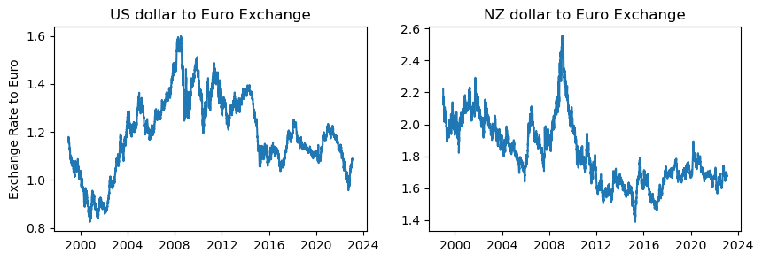
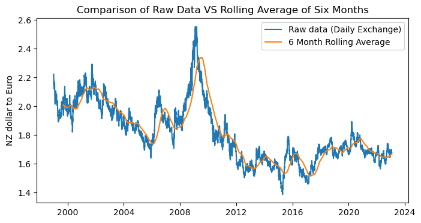
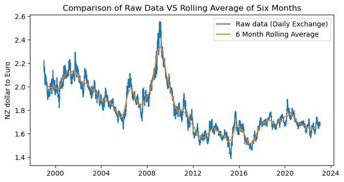
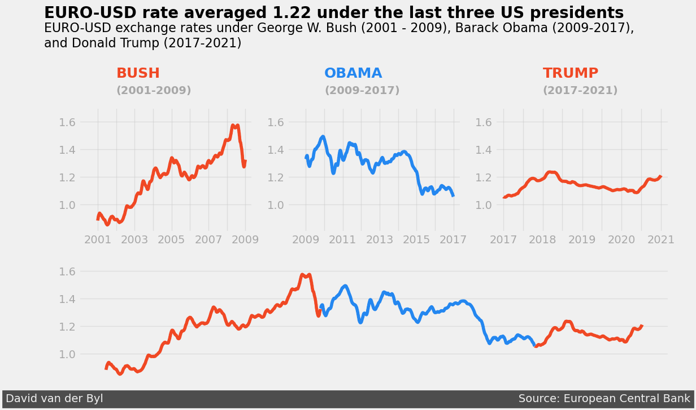

# Project: Storytelling Data Visualization on Exchange Rates
---

This project puts to use both `exploratory` and `explanatory`` data visualisation techniques to examine, and present findings on the Euro Daily Exchange Rates from 1999 to 2023 (start of 2023) [dataset link here](https://www.kaggle.com/datasets/lsind18/euro-exchange-daily-rates-19992020). The focus will be on the exchange rate between the `US_dollar` to`Euro` and `NZ_dollar` to `Euro`.

## 1. Reading and Initial Exploration of Data
---


```python
# importing libraries
import pandas as pd
import seaborn as sns
import matplotlib.pyplot as plt
%matplotlib inline
# %matplotlib widget -> this is very useful however figure configurations in this project not supported
from datetime import datetime
```


```python
# Reading csv as pandas dataframe
exchange_rates_df = pd.read_csv("data/euro-daily-hist_1999_2022.csv")

# Display first 5 rows of data
exchange_rates_df.head()
```


<div>
<style scoped>
    .dataframe tbody tr th:only-of-type {
        vertical-align: middle;
    }

    .dataframe tbody tr th {
        vertical-align: top;
    }

    .dataframe thead th {
        text-align: right;
    }
</style>
<table border="1" class="dataframe">
  <thead>
    <tr style="text-align: right;">
      <th></th>
      <th>Period\Unit:</th>
      <th>[Australian dollar ]</th>
      <th>[Bulgarian lev ]</th>
      <th>[Brazilian real ]</th>
      <th>[Canadian dollar ]</th>
      <th>[Swiss franc ]</th>
      <th>[Chinese yuan renminbi ]</th>
      <th>[Cypriot pound ]</th>
      <th>[Czech koruna ]</th>
      <th>[Danish krone ]</th>
      <th>...</th>
      <th>[Romanian leu ]</th>
      <th>[Russian rouble ]</th>
      <th>[Swedish krona ]</th>
      <th>[Singapore dollar ]</th>
      <th>[Slovenian tolar ]</th>
      <th>[Slovak koruna ]</th>
      <th>[Thai baht ]</th>
      <th>[Turkish lira ]</th>
      <th>[US dollar ]</th>
      <th>[South African rand ]</th>
    </tr>
  </thead>
  <tbody>
    <tr>
      <th>0</th>
      <td>2023-01-27</td>
      <td>1.5289</td>
      <td>1.9558</td>
      <td>5.5104</td>
      <td>1.4479</td>
      <td>1.0017</td>
      <td>7.3690</td>
      <td>NaN</td>
      <td>23.826</td>
      <td>7.4378</td>
      <td>...</td>
      <td>4.8965</td>
      <td>NaN</td>
      <td>11.2108</td>
      <td>1.4277</td>
      <td>NaN</td>
      <td>NaN</td>
      <td>35.7020</td>
      <td>20.4365</td>
      <td>1.0865</td>
      <td>18.7185</td>
    </tr>
    <tr>
      <th>1</th>
      <td>2023-01-26</td>
      <td>1.5308</td>
      <td>1.9558</td>
      <td>5.5572</td>
      <td>1.4568</td>
      <td>1.0002</td>
      <td>7.3893</td>
      <td>NaN</td>
      <td>23.818</td>
      <td>7.4383</td>
      <td>...</td>
      <td>4.8818</td>
      <td>NaN</td>
      <td>11.1763</td>
      <td>1.4292</td>
      <td>NaN</td>
      <td>NaN</td>
      <td>35.6870</td>
      <td>20.4961</td>
      <td>1.0895</td>
      <td>18.6127</td>
    </tr>
    <tr>
      <th>2</th>
      <td>2023-01-25</td>
      <td>1.5360</td>
      <td>1.9558</td>
      <td>5.5690</td>
      <td>1.4544</td>
      <td>1.0020</td>
      <td>7.3778</td>
      <td>NaN</td>
      <td>23.808</td>
      <td>7.4381</td>
      <td>...</td>
      <td>4.9035</td>
      <td>NaN</td>
      <td>11.1335</td>
      <td>1.4307</td>
      <td>NaN</td>
      <td>NaN</td>
      <td>35.7180</td>
      <td>20.4658</td>
      <td>1.0878</td>
      <td>18.6745</td>
    </tr>
    <tr>
      <th>3</th>
      <td>2023-01-24</td>
      <td>1.5470</td>
      <td>1.9558</td>
      <td>5.6164</td>
      <td>1.4517</td>
      <td>1.0053</td>
      <td>7.3642</td>
      <td>NaN</td>
      <td>23.874</td>
      <td>7.4399</td>
      <td>...</td>
      <td>4.9171</td>
      <td>NaN</td>
      <td>11.0995</td>
      <td>1.4337</td>
      <td>NaN</td>
      <td>NaN</td>
      <td>35.6090</td>
      <td>20.4234</td>
      <td>1.0858</td>
      <td>18.7687</td>
    </tr>
    <tr>
      <th>4</th>
      <td>2023-01-23</td>
      <td>1.5529</td>
      <td>1.9558</td>
      <td>5.6372</td>
      <td>1.4523</td>
      <td>1.0013</td>
      <td>7.3730</td>
      <td>NaN</td>
      <td>23.881</td>
      <td>7.4393</td>
      <td>...</td>
      <td>4.9202</td>
      <td>NaN</td>
      <td>11.1183</td>
      <td>1.4328</td>
      <td>NaN</td>
      <td>NaN</td>
      <td>35.6300</td>
      <td>20.4478</td>
      <td>1.0871</td>
      <td>18.6597</td>
    </tr>
  </tbody>
</table>
<p>5 rows × 41 columns</p>
</div>


```python
# Display last 5 rows of data
exchange_rates_df.tail()
```


<div>
<style scoped>
    .dataframe tbody tr th:only-of-type {
        vertical-align: middle;
    }

    .dataframe tbody tr th {
        vertical-align: top;
    }

    .dataframe thead th {
        text-align: right;
    }
</style>
<table border="1" class="dataframe">
  <thead>
    <tr style="text-align: right;">
      <th></th>
      <th>Period\Unit:</th>
      <th>[Australian dollar ]</th>
      <th>[Bulgarian lev ]</th>
      <th>[Brazilian real ]</th>
      <th>[Canadian dollar ]</th>
      <th>[Swiss franc ]</th>
      <th>[Chinese yuan renminbi ]</th>
      <th>[Cypriot pound ]</th>
      <th>[Czech koruna ]</th>
      <th>[Danish krone ]</th>
      <th>...</th>
      <th>[Romanian leu ]</th>
      <th>[Russian rouble ]</th>
      <th>[Swedish krona ]</th>
      <th>[Singapore dollar ]</th>
      <th>[Slovenian tolar ]</th>
      <th>[Slovak koruna ]</th>
      <th>[Thai baht ]</th>
      <th>[Turkish lira ]</th>
      <th>[US dollar ]</th>
      <th>[South African rand ]</th>
    </tr>
  </thead>
  <tbody>
    <tr>
      <th>6224</th>
      <td>1999-01-08</td>
      <td>1.8406</td>
      <td>NaN</td>
      <td>NaN</td>
      <td>1.7643</td>
      <td>1.6138</td>
      <td>NaN</td>
      <td>0.58187</td>
      <td>34.938</td>
      <td>7.4433</td>
      <td>...</td>
      <td>1.3143</td>
      <td>27.2075</td>
      <td>9.1650</td>
      <td>1.9537</td>
      <td>188.8400</td>
      <td>42.560</td>
      <td>42.5590</td>
      <td>0.3718</td>
      <td>1.1659</td>
      <td>6.7855</td>
    </tr>
    <tr>
      <th>6225</th>
      <td>1999-01-07</td>
      <td>1.8474</td>
      <td>NaN</td>
      <td>NaN</td>
      <td>1.7602</td>
      <td>1.6165</td>
      <td>NaN</td>
      <td>0.58187</td>
      <td>34.886</td>
      <td>7.4431</td>
      <td>...</td>
      <td>1.3092</td>
      <td>26.9876</td>
      <td>9.1800</td>
      <td>1.9436</td>
      <td>188.8000</td>
      <td>42.765</td>
      <td>42.1678</td>
      <td>0.3701</td>
      <td>1.1632</td>
      <td>6.8283</td>
    </tr>
    <tr>
      <th>6226</th>
      <td>1999-01-06</td>
      <td>1.8820</td>
      <td>NaN</td>
      <td>NaN</td>
      <td>1.7711</td>
      <td>1.6116</td>
      <td>NaN</td>
      <td>0.58200</td>
      <td>34.850</td>
      <td>7.4452</td>
      <td>...</td>
      <td>1.3168</td>
      <td>27.4315</td>
      <td>9.3050</td>
      <td>1.9699</td>
      <td>188.7000</td>
      <td>42.778</td>
      <td>42.6949</td>
      <td>0.3722</td>
      <td>1.1743</td>
      <td>6.7307</td>
    </tr>
    <tr>
      <th>6227</th>
      <td>1999-01-05</td>
      <td>1.8944</td>
      <td>NaN</td>
      <td>NaN</td>
      <td>1.7965</td>
      <td>1.6123</td>
      <td>NaN</td>
      <td>0.58230</td>
      <td>34.917</td>
      <td>7.4495</td>
      <td>...</td>
      <td>1.3168</td>
      <td>26.5876</td>
      <td>9.4025</td>
      <td>1.9655</td>
      <td>188.7750</td>
      <td>42.848</td>
      <td>42.5048</td>
      <td>0.3728</td>
      <td>1.1790</td>
      <td>6.7975</td>
    </tr>
    <tr>
      <th>6228</th>
      <td>1999-01-04</td>
      <td>1.9100</td>
      <td>NaN</td>
      <td>NaN</td>
      <td>1.8004</td>
      <td>1.6168</td>
      <td>NaN</td>
      <td>0.58231</td>
      <td>35.107</td>
      <td>7.4501</td>
      <td>...</td>
      <td>1.3111</td>
      <td>25.2875</td>
      <td>9.4696</td>
      <td>1.9554</td>
      <td>189.0450</td>
      <td>42.991</td>
      <td>42.6799</td>
      <td>0.3723</td>
      <td>1.1789</td>
      <td>6.9358</td>
    </tr>
  </tbody>
</table>
<p>5 rows × 41 columns</p>
</div>


```python
# display info on columns
exchange_rates_df.info()
```

    <class 'pandas.core.frame.DataFrame'>
    RangeIndex: 6229 entries, 0 to 6228
    Data columns (total 41 columns):
     #   Column                    Non-Null Count  Dtype  
    ---  ------                    --------------  -----  
     0   Period\Unit:              6229 non-null   object 
     1   [Australian dollar ]      6229 non-null   object 
     2   [Bulgarian lev ]          5827 non-null   object 
     3   [Brazilian real ]         5961 non-null   object 
     4   [Canadian dollar ]        6229 non-null   object 
     5   [Swiss franc ]            6229 non-null   object 
     6   [Chinese yuan renminbi ]  5961 non-null   object 
     7   [Cypriot pound ]          2346 non-null   object 
     8   [Czech koruna ]           6229 non-null   object 
     9   [Danish krone ]           6229 non-null   object 
     10  [Estonian kroon ]         3130 non-null   object 
     11  [UK pound sterling ]      6229 non-null   object 
     12  [Greek drachma ]          520 non-null    object 
     13  [Hong Kong dollar ]       6229 non-null   object 
     14  [Croatian kuna ]          5941 non-null   object 
     15  [Hungarian forint ]       6229 non-null   object 
     16  [Indonesian rupiah ]      6229 non-null   object 
     17  [Israeli shekel ]         5961 non-null   object 
     18  [Indian rupee ]           5961 non-null   object 
     19  [Iceland krona ]          3822 non-null   float64
     20  [Japanese yen ]           6229 non-null   object 
     21  [Korean won ]             6229 non-null   object 
     22  [Lithuanian litas ]       4159 non-null   object 
     23  [Latvian lats ]           3904 non-null   object 
     24  [Maltese lira ]           2346 non-null   object 
     25  [Mexican peso ]           6229 non-null   object 
     26  [Malaysian ringgit ]      6229 non-null   object 
     27  [Norwegian krone ]        6229 non-null   object 
     28  [New Zealand dollar ]     6229 non-null   object 
     29  [Philippine peso ]        6229 non-null   object 
     30  [Polish zloty ]           6229 non-null   object 
     31  [Romanian leu ]           6167 non-null   float64
     32  [Russian rouble ]         5994 non-null   object 
     33  [Swedish krona ]          6229 non-null   object 
     34  [Singapore dollar ]       6229 non-null   object 
     35  [Slovenian tolar ]        2085 non-null   object 
     36  [Slovak koruna ]          2608 non-null   object 
     37  [Thai baht ]              6229 non-null   object 
     38  [Turkish lira ]           6167 non-null   float64
     39  [US dollar ]              6229 non-null   object 
     40  [South African rand ]     6229 non-null   object 
    dtypes: float64(3), object(38)
    memory usage: 1.9+ MB


<br>

**Observation from above:**

 - Columns are currencies of mainly type string (pandas object) with some of type float.
 
 - Most currencies have a data entry count of about 5,000-6,000. However, the `Greek drachma` has a low data entry count of 520
 
 <br>

## 2. Data Cleaning
---

Given the focus in this project on the `US_dollor`, `NZ_dollor` and the `Euro` these columns will also be the focus of data cleaning, with the following steps performed:

- Renaming the currency `[US dollar]`, `[New Zealand dollar ]` column and the `period/unit` name to something easier to type - say `US_dollar`, `NZ_dollar` and `Time`

- Change the `Time` column type to pandas datetime

- Sort the times in ascending order


```python
# renaming columns
exchange_rates_df.rename(columns={'[US dollar ]': 'US_dollar','[New Zealand dollar ]': 'NZ_dollar', 'Period\\Unit:': 'Time'},inplace=True)

# converter the Time column to type datatime
exchange_rates_df['Time'] = pd.to_datetime(exchange_rates_df['Time'])

# Sorting time in ascending order
exchange_rates_df.sort_values('Time', inplace=True)

# As the order was changed from descending to ascending the integer index label (row label) is reset
exchange_rates_df.reset_index(drop=True, inplace=True)

# Display First 5 rows (including header) of the US_dollar to Euro exchange rate
exchange_rates_df[['Time','US_dollar']].head()
```


<div>
<style scoped>
    .dataframe tbody tr th:only-of-type {
        vertical-align: middle;
    }

    .dataframe tbody tr th {
        vertical-align: top;
    }

    .dataframe thead th {
        text-align: right;
    }
</style>
<table border="1" class="dataframe">
  <thead>
    <tr style="text-align: right;">
      <th></th>
      <th>Time</th>
      <th>US_dollar</th>
    </tr>
  </thead>
  <tbody>
    <tr>
      <th>0</th>
      <td>1999-01-04</td>
      <td>1.1789</td>
    </tr>
    <tr>
      <th>1</th>
      <td>1999-01-05</td>
      <td>1.1790</td>
    </tr>
    <tr>
      <th>2</th>
      <td>1999-01-06</td>
      <td>1.1743</td>
    </tr>
    <tr>
      <th>3</th>
      <td>1999-01-07</td>
      <td>1.1632</td>
    </tr>
    <tr>
      <th>4</th>
      <td>1999-01-08</td>
      <td>1.1659</td>
    </tr>
  </tbody>
</table>
</div>


```python
# Display First 5 rows (including header) of the NZ_dollar to Euro exchange rate
exchange_rates_df[['Time','NZ_dollar']].head()
```


<div>
<style scoped>
    .dataframe tbody tr th:only-of-type {
        vertical-align: middle;
    }

    .dataframe tbody tr th {
        vertical-align: top;
    }

    .dataframe thead th {
        text-align: right;
    }
</style>
<table border="1" class="dataframe">
  <thead>
    <tr style="text-align: right;">
      <th></th>
      <th>Time</th>
      <th>NZ_dollar</th>
    </tr>
  </thead>
  <tbody>
    <tr>
      <th>0</th>
      <td>1999-01-04</td>
      <td>2.2229</td>
    </tr>
    <tr>
      <th>1</th>
      <td>1999-01-05</td>
      <td>2.2011</td>
    </tr>
    <tr>
      <th>2</th>
      <td>1999-01-06</td>
      <td>2.1890</td>
    </tr>
    <tr>
      <th>3</th>
      <td>1999-01-07</td>
      <td>2.1531</td>
    </tr>
    <tr>
      <th>4</th>
      <td>1999-01-08</td>
      <td>2.1557</td>
    </tr>
  </tbody>
</table>
</div>


```python
# isolating the US to Euro exchange with a copied dataframe
euro_to_US_df = exchange_rates_df[['Time', 'US_dollar']].copy()

# display a freqeuncy table of unique data entries in the US_dollar column
euro_to_US_df['US_dollar'].value_counts() 
```


    US_dollar
    -         62
    1.2276     9
    1.1215     8
    1.1268     7
    1.1305     7
              ..
    1.3818     1
    1.3591     1
    1.3405     1
    1.3580     1
    1.0865     1
    Name: count, Length: 3718, dtype: int64


```python
# isolating the NZ to Euro exchange with a copied dataframe
euro_to_NZ_df = exchange_rates_df[['Time', 'NZ_dollar']].copy()

# display a freqeuncy table of unique data entries in the NZ_dollar column
euro_to_NZ_df['NZ_dollar'].value_counts() 
```


    NZ_dollar
    -         62
    1.6737     8
    1.6769     7
    1.6601     7
    1.6853     6
              ..
    1.9216     1
    1.8709     1
    1.8663     1
    1.8766     1
    1.6852     1
    Name: count, Length: 4003, dtype: int64


<br>

**Observation from above:**

 - There are 62 '-' characters entries in both the `US_dollar` and `NZ_dollar`, this rows will be removed next
 
 <br>


```python
# creating a bool index pandas series (list) based on rows in US_dollar not equall to the '-' char
euro_to_US_bool = euro_to_US_df['US_dollar'] != '-'

# using the boolean index series to remove '-' char rows
euro_to_US_df = euro_to_US_df[euro_to_US_bool]

'''
# The removal of the '-' char could have alternatively been done like the following:

euro_to_dollar_df = euro_to_dollar_df[euro_to_dollar_df['US_dollar'] != '-']

'''

# converting remain rows to float from string
euro_to_US_df['US_dollar'] = euro_to_US_df['US_dollar'].astype(float)

# displaying info on the cleaner dataframe
euro_to_US_df.info()


```

    <class 'pandas.core.frame.DataFrame'>
    Index: 6167 entries, 0 to 6228
    Data columns (total 2 columns):
     #   Column     Non-Null Count  Dtype         
    ---  ------     --------------  -----         
     0   Time       6167 non-null   datetime64[ns]
     1   US_dollar  6167 non-null   float64       
    dtypes: datetime64[ns](1), float64(1)
    memory usage: 144.5 KB


```python
# Removal of the '-' char using the short hand (chaining) alternative method described above:
euro_to_NZ_df = euro_to_NZ_df[euro_to_NZ_df['NZ_dollar'] != '-']


# converting remain rows to float from string
euro_to_NZ_df['NZ_dollar'] = euro_to_NZ_df['NZ_dollar'].astype(float)

# displaying info on the cleaner dataframe
euro_to_NZ_df.info()
```

    <class 'pandas.core.frame.DataFrame'>
    Index: 6167 entries, 0 to 6228
    Data columns (total 2 columns):
     #   Column     Non-Null Count  Dtype         
    ---  ------     --------------  -----         
     0   Time       6167 non-null   datetime64[ns]
     1   NZ_dollar  6167 non-null   float64       
    dtypes: datetime64[ns](1), float64(1)
    memory usage: 144.5 KB


## 3. Rolling Mean
---

Now the `US_dollar` and `NZ_columns` columns are cleaned some visual exploring will be completed.


```python
# Display raw euro_to_US_df and euro_to_NZ_df exchange data verse time

fig, (ax1, ax2) = plt.subplots(nrows=1, ncols=2, figsize=(10,3)) # Creating 2 subplots (1 row, 2 col)

# plotting US to Euro exchange rate with title and ylabel
ax1.plot(euro_to_US_df['Time'], euro_to_US_df['US_dollar'])
ax1.set_title("US dollar to Euro Exchange")
ax1.set_ylabel("Exchange Rate to Euro")

# plotting NZ to Euro exchange rate with title
ax2.plot(euro_to_NZ_df['Time'], euro_to_NZ_df['NZ_dollar'])
ax2.set_title("NZ dollar to Euro Exchange")

plt.show()
```


    

    


<br>

**Observation from above:**

 - Plenty of daily variation, depending on the required analysis this high frequency component could be filtered via a rolling average/mean
 
 <br>


```python
# Add a column to the euro_to_US_df and euro_to_NZ_df dataframe of a 30 day rolling average
euro_to_US_df['rolling_mean_30_day'] = euro_to_US_df['US_dollar'].rolling(30).mean()

euro_to_NZ_df['rolling_mean_30_day'] = euro_to_NZ_df['NZ_dollar'].rolling(30).mean()
```


```python
# Display raw euro_to_US_df and euro_to_NZ_df exchange data verse time

fig, (ax1, ax2) = plt.subplots(nrows=1, ncols=2, figsize=(10,3)) # Creating 2 subplots (1 row, 2 col)

# plotting US to Euro exchange rate with title and ylabel
ax1.plot(euro_to_US_df['Time'], euro_to_US_df['rolling_mean_30_day'])
ax1.set_title("US to Euro Exchange 30 Day Rolling Average")
ax1.set_ylabel("Exchange Rate to Euro")

# plotting NZ to Euro exchange rate with title
ax2.plot(euro_to_NZ_df['Time'], euro_to_NZ_df['rolling_mean_30_day'])
ax2.set_title("NZ to Euro Exchange 30 Day Rolling Average")

plt.show()
```


    

    


<br>

**Observation from above:**

 - The daily variation has been smoothed via a 30 day rolling average
 
 
 <br>

### 3.1 Removing the Introduced Delay/Offset from a Rolling Average
---


```python
# Creating a large delay with a 6 month rolling average
six_months_2_days = int(round(365/2,0))
euro_to_NZ_df['rolling_mean_6_month'] = euro_to_NZ_df['NZ_dollar'].rolling(six_months_2_days).mean()
```


```python
'''
compare the raw to 6 month rolling average data to show the present of an introducted delay.
'''
plt.figure(figsize=(8, 4)) # change figure size
plt.plot(euro_to_NZ_df['Time'], euro_to_NZ_df['NZ_dollar'], label="Raw data (Daily Exchange)")
plt.plot(euro_to_NZ_df['Time'], euro_to_NZ_df['rolling_mean_6_month'], label="6 Month Rolling Average")

plt.title("Comparison of Raw Data VS Rolling Average of Six Months")
plt.ylabel("NZ dollar to Euro")
plt.legend(loc="upper right")
plt.show()
```


    

    


To remove the delay introduced by a six month rolling average the time column index needs to be shifted back by half the sample period (3 months).


```python
# Adding a new column to the euro_to_NZ_df dataframe of time with a 3 month shift to the left for correcting 
# the offset induced by a 6 month rolling average
euro_to_NZ_df['Time_3_month_shift'] = euro_to_NZ_df['Time'].shift(int(six_months_2_days/2))
```


```python
'''
Plotting the raw data VS 6 month rolling average data with its induced offset corrected
'''
plt.figure(figsize=(8, 4)) # change figure size
plt.plot(euro_to_NZ_df['Time'], euro_to_NZ_df['NZ_dollar'], label="Raw data (Daily Exchange)")
plt.plot(euro_to_NZ_df['Time_3_month_shift'], euro_to_NZ_df['rolling_mean_6_month'], label="6 Month Rolling Average")

plt.title("Comparison of Raw Data VS Rolling Average of Six Months")
plt.ylabel("NZ dollar to Euro")
plt.legend(loc="upper right")
plt.show()
```


    

    


<br>

**Observation from above:**

Depending on how the rolling average data is used will depend on the method for correcting. If for example, the data is only used when plotting the induced delay/offset can be romoved without creating a new column of datetime in the dataframe. Instead it can be removed during the plotting process with `series.shift(period = (rolling average preiods)/2 )`:

```
plt.plot(euro_to_NZ_df['Time'].(period = (rolling average preiods)/2 , euro_to_NZ_df['rolling_average'], label="Rolling average")
```
 
 
 <br>

## 4. Story Telling (Explanatory Visualisation)

This Section marks the start of the story telling process in this project. This story(s) will show two things:

 - How the euro to US and NZ dollar was affected during and after the 2008 financial crisis.
 
 - How the euro to US and NZ dollar was affected during and after the coronavirus pandemic.
 
 Matplotlib's example library is a useful resource for this one [link here](https://matplotlib.org/stable/gallery/index.html)

### 4.1 Shifting time column for 30 Day rolling Average
---

Given the 30 day rolling average will be used throughout this exercise a new shift time column for both dataframes will be add to account for the offset created by this averaging.


```python
# 15 is used as the shift period as the offset induced by the 30 day rolling average is half the averaging window (15 days)
euro_to_US_df['Time_15_day_shift'] = euro_to_US_df['Time'].shift(15)
euro_to_NZ_df['Time_15_day_shift'] = euro_to_NZ_df['Time'].shift(15)
```

### 4.2 Plotting US to Euro for President Eras in US
---


```python
# Creating seperate dataframes for the three president eras from 2001 - 2023
bush_obama_trump = euro_to_US_df.copy()[(euro_to_US_df['Time'].dt.year >= 2001) & (euro_to_US_df['Time'].dt.year < 2021)]
bush = bush_obama_trump.copy()[bush_obama_trump['Time'].dt.year < 2009]
obama = bush_obama_trump.copy()[(bush_obama_trump['Time'].dt.year >= 2009) & (bush_obama_trump['Time'].dt.year < 2017)]
trump = bush_obama_trump.copy()[(bush_obama_trump['Time'].dt.year >= 2017) & (bush_obama_trump['Time'].dt.year < 2021)]
```


```python
### Adding the FiveThirtyEight style
plt.style.use('fivethirtyeight')

### Adding the subplot
plt.figure(figsize=(12, 6))
ax1 = plt.subplot(2,3,1)
ax2 = plt.subplot(2,3,2)
ax3 = plt.subplot(2,3,3)
ax4 = plt.subplot(2,1,2)
axes = [ax1, ax2, ax3, ax4]


# Setting plot colours
Republican_red = '#F04824'  
democrat_blue = '#2487F0'

# Creating dictionary of president eras dataframes (unused!)
era_dict = {'Bush' : bush, 
            'Obama' : obama, 
            'Trump' : trump
           }


### Changes to all the subplots
for ax in axes:
    
    # Creating sub plot 
    ax.set_ylim(0.8, 1.7)
    ax.set_yticks([1.0, 1.2, 1.4, 1.6])
    ax.set_yticklabels(['1.0', '1.2','1.4', '1.6'],alpha=0.3)
    ax.grid(alpha=0.5)    


### Ax1: Bush
ax1.plot(bush['Time'], bush['rolling_mean_30_day'],color=Republican_red)
ax1_xloc = ax1.get_xticks().tolist()
ax1.set_xticks(ax1_xloc)
ax1.set_xticklabels(['', '2001', '', '2003', '', '2005', '','2007', '', '2009'],alpha=0.3)
ax1.text(ax1_xloc[2], 1.92, 'BUSH', fontsize=18, weight='bold',color=Republican_red)
ax1.text(ax1_xloc[2], 1.8, '(2001-2009)', weight='bold',alpha=0.3)

### Ax2: Obama
ax2.plot(obama['Time'], obama['rolling_mean_30_day'],color=democrat_blue)
ax2_xloc = ax2.get_xticks().tolist()
ax2.set_xticks(ax2_xloc)
ax2.set_xticklabels(['', '2009', '', '2011', '', '2013', '','2015', '', '2017'],alpha=0.3)
ax2.text(ax2_xloc[2], 1.92, 'OBAMA', fontsize=18, weight='bold',color=democrat_blue)
ax2.text(ax2_xloc[2], 1.8, '(2009-2017)', weight='bold',alpha=0.3)


### Ax3: Trump
ax3.plot(trump['Time'], trump['rolling_mean_30_day'],color=Republican_red)
ax3_xloc = ax3.get_xticks().tolist()
ax3.set_xticks(ax3_xloc)
ax3.set_xticklabels(['2017', '', '2018', '', '2019', '','2020', '', '2021'],alpha=0.3)
ax3.text(ax3_xloc[2], 1.92, 'TRUMP', fontsize=18, weight='bold',color=Republican_red)
ax3.text(ax3_xloc[2], 1.8, '(2017-2021)', weight='bold',alpha=0.3)

### Ax4: Bush-Obama-Trump
ax4.plot(bush['Time'], bush['rolling_mean_30_day'],color=Republican_red)
ax4.plot(obama['Time'], obama['rolling_mean_30_day'],color=democrat_blue)
ax4.plot(trump['Time'], trump['rolling_mean_30_day'],color=Republican_red)
ax4.grid(alpha=0.5)
ax4.set_xticks([])

### Adding a title and a subtitle
ax1.text(ax1_xloc[0]-700, 2.35, 'EURO-USD rate averaged 1.22 under the last three US presidents',fontsize=20, weight='bold')
ax1.text(ax1_xloc[0]-700, 2.14, '''EURO-USD exchange rates under George W. Bush (2001 - 2009), Barack Obama (2009-2017),
and Donald Trump (2017-2021)''',
        fontsize=16)

### Adding a signature
ax4_xloc = ax4.get_xticks().tolist()
ax4.text(ax1_xloc[0]-1000, 0.65, 'David van der Byl' + ' '*120 + 'Source: European Central Bank',color = '#f0f0f0', backgroundcolor = '#4d4d4d',size=14)

plt.show()
```


    

    


### 4.3 Plotting NZ to Euro for Party in Government Eras in NZ
---


```python
# Creating seperate dataframes for the three president eras from 2001 - 2023
lab_helen = euro_to_NZ_df.copy().loc[euro_to_NZ_df['Time'].between("1999-12-10", "2008-11-19")]
nat_john = euro_to_NZ_df.copy().loc[euro_to_NZ_df['Time'].between("2008-11-18", "2017-10-26")]
lab_jac = euro_to_NZ_df.copy().loc[euro_to_NZ_df['Time'].between("2017-10-27", "2023-01-27")]
```


```python
### Adding the FiveThirtyEight style
plt.style.use('fivethirtyeight')

### Adding the subplot
plt.figure(figsize=(12, 6))
ax1 = plt.subplot(2,3,1)
ax2 = plt.subplot(2,3,2)
ax3 = plt.subplot(2,3,3)
ax4 = plt.subplot(2,1,2)
axes = [ax1, ax2, ax3, ax4]


# Setting plot colours
labour_red = '#F04824'  
national_blue = '#2487F0'

### Changes to all the subplots
for ax in axes:
    
    # Creating sub plot 
    #ax.set_ylim(0.8, 1.7)
    #ax.set_yticks([1.0, 1.2, 1.4, 1.6])
    #ax.set_yticklabels(['1.0', '1.2','1.4', '1.6'],alpha=0.3)
    ax.grid(alpha=0.5)    


### Ax1: Labour Helen Clark
ax1.plot(lab_helen['Time'], lab_helen['rolling_mean_30_day'],color=labour_red)
ax1_xloc = ax1.get_xticks().tolist()
ax1.set_xticks(ax1_xloc)
ax1.set_xticklabels(['1999', '', '2001', '', '2003', '','2005', '', '2007', '', '2008'],alpha=0.3)
ax1.text(ax1_xloc[1], 2.35, 'Labour (Clark)', fontsize=18, weight='bold',color=labour_red)
ax1.text(ax1_xloc[2], 2.28, '(1999-2008)', weight='bold',alpha=0.3)

### Ax2: National John Key
ax2.plot(nat_john['Time'], nat_john['rolling_mean_30_day'],color=national_blue)
ax2_xloc = ax2.get_xticks().tolist()
ax2.set_xticks(ax2_xloc)
ax2.set_xticklabels(['', '2008', '', '2010', '', '2012', '','2014', '', '2016', ''],alpha=0.3)
ax2.text(ax2_xloc[1], 2.8, 'National (Key)', fontsize=18, weight='bold',color=national_blue)
ax2.text(ax2_xloc[2], 2.65, '(2009-2017)', weight='bold',alpha=0.3)


### Ax3: Labour Jacinda Ardern
ax3.plot(lab_jac['Time'], lab_jac['rolling_mean_30_day'],color=labour_red)
ax3_xloc = ax3.get_xticks().tolist()
ax3.set_xticks(ax3_xloc)
ax3.set_xticklabels(['2017', '', '2019', '', '2021', '','2023'],alpha=0.3)
ax3.text(ax3_xloc[1], 1.9, 'Labour (Ardern)', fontsize=18, weight='bold',color=labour_red)
ax3.text(ax3_xloc[2], 1.87, '(2017-2021)', weight='bold',alpha=0.3)

### Ax4: Bush-Obama-Trump
ax4.plot(lab_helen['Time'], lab_helen['rolling_mean_30_day'],color=labour_red)
ax4.plot(nat_john['Time'], nat_john['rolling_mean_30_day'],color=national_blue)
ax4.plot(lab_jac['Time'], lab_jac['rolling_mean_30_day'],color=labour_red)
ax4.grid(alpha=0.5)
ax4.set_xticks([])

### Adding a title and a subtitle
ax1.text(ax1_xloc[0]-700, 2.63, 'EURO-NZD rate averaged 1.81 under the last three NZ governments',fontsize=20, weight='bold')
ax1.text(ax1_xloc[0]-700, 2.48, '''EURO-NZD exchange rates under Labour - Helen Clark (1999 - 2008), National - John Key (2008-2017),
and Labour - Jacinda Ardern (2017-Present)''',
       fontsize=16,alpha=0.6)

### Adding a signature
ax4_xloc = ax4.get_xticks().tolist()
ax4.text(ax1_xloc[0]-1000, 1, 'David van der Byl' + ' '*120 + 'Source: European Central Bank',color = '#f0f0f0', backgroundcolor = '#4d4d4d',size=14)

plt.show()
```


    

    


```python
nz = euro_to_NZ_df.copy().loc[euro_to_NZ_df['Time'].between("1999-12-10", "2023-01-27")]

nz.describe()
```


<div>
<style scoped>
    .dataframe tbody tr th:only-of-type {
        vertical-align: middle;
    }

    .dataframe tbody tr th {
        vertical-align: top;
    }

    .dataframe thead th {
        text-align: right;
    }
</style>
<table border="1" class="dataframe">
  <thead>
    <tr style="text-align: right;">
      <th></th>
      <th>Time</th>
      <th>NZ_dollar</th>
      <th>rolling_mean_30_day</th>
      <th>rolling_mean_6_month</th>
      <th>Time_3_month_shift</th>
      <th>Time_15_day_shift</th>
    </tr>
  </thead>
  <tbody>
    <tr>
      <th>count</th>
      <td>5923</td>
      <td>5923.000000</td>
      <td>5923.000000</td>
      <td>5923.000000</td>
      <td>5923</td>
      <td>5923</td>
    </tr>
    <tr>
      <th>mean</th>
      <td>2011-07-09 00:19:41.563396864</td>
      <td>1.805786</td>
      <td>1.806561</td>
      <td>1.810893</td>
      <td>2011-03-01 04:46:52.898868992</td>
      <td>2011-06-17 14:42:46.132027904</td>
    </tr>
    <tr>
      <th>min</th>
      <td>1999-12-10 00:00:00</td>
      <td>1.388400</td>
      <td>1.426247</td>
      <td>1.515669</td>
      <td>1999-08-05 00:00:00</td>
      <td>1999-11-19 00:00:00</td>
    </tr>
    <tr>
      <th>25%</th>
      <td>2005-09-24 12:00:00</td>
      <td>1.657600</td>
      <td>1.657555</td>
      <td>1.651858</td>
      <td>2005-05-19 12:00:00</td>
      <td>2005-09-03 12:00:00</td>
    </tr>
    <tr>
      <th>50%</th>
      <td>2011-07-07 00:00:00</td>
      <td>1.756100</td>
      <td>1.757133</td>
      <td>1.768774</td>
      <td>2011-02-28 00:00:00</td>
      <td>2011-06-16 00:00:00</td>
    </tr>
    <tr>
      <th>75%</th>
      <td>2017-04-19 12:00:00</td>
      <td>1.952450</td>
      <td>1.950253</td>
      <td>1.965395</td>
      <td>2016-12-08 12:00:00</td>
      <td>2017-03-27 12:00:00</td>
    </tr>
    <tr>
      <th>max</th>
      <td>2023-01-27 00:00:00</td>
      <td>2.553500</td>
      <td>2.499367</td>
      <td>2.338489</td>
      <td>2022-09-21 00:00:00</td>
      <td>2023-01-06 00:00:00</td>
    </tr>
    <tr>
      <th>std</th>
      <td>NaN</td>
      <td>0.202542</td>
      <td>0.200848</td>
      <td>0.194078</td>
      <td>NaN</td>
      <td>NaN</td>
    </tr>
  </tbody>
</table>
</div>


```python

```
