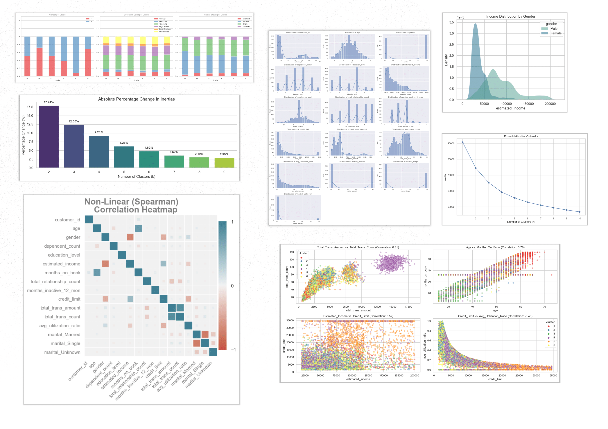
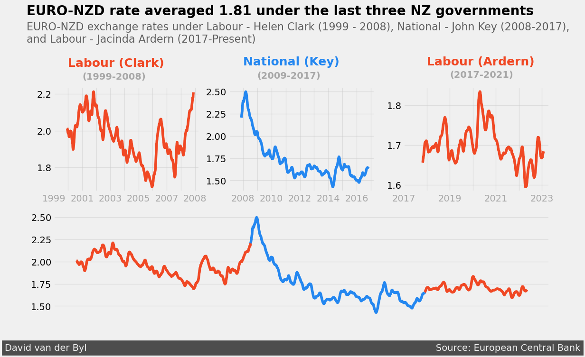

 

# Data Science Projects

 

<!-- 

  

-->

 

Welcome to my data science portfolio! This repository showcases a diverse range of data science projects, highlighting the versatility of Python in addressing various data-centric challenges.

 

## Table of Contents

- [Machine Learning](#machine-learning)
- [Probability and Statistics](#probability-and-statistics)
- [Data Cleaning](#data-cleaning)
- [Data Visualization](#data-visualization)

---
 

## Machine Learning

[Explore Projects](https://github.com/David-vanderByl/Data-Science-Projects/tree/main/Machine%20Learning)

Machine learning is the heart of modern data science. This section features projects that demonstrate my solid foundation in machine learning concepts. From predictive modelling to model validation, I've utilized the Scikit-learn library in Python to implement, evaluate, and fine-tune various machine-learning techniques.

- **Supervised Machine Learning - Predicting Heart Disease**

Using a dataset with lower-quality health data, I've built and optimized a k-nearest neighbours classifier model through grid-search for hyperparameter tuning.

- **Supervised Machine Learning - Predicting Health Insurance Costs**

Using linear Regression this project's primary objective is to investigate the cost of health insurance against a number of key indicators. The data can be found on [Kaggle](https://www.kaggle.com/datasets/mirichoi0218/insurance?resource=downloa) and includes 1338 patients, which makes it somewhat limited, but it's interesting to see how limited data can be used to draw insights. 

- **Supervised Machine Learning - Linear Regression using Stochastic Gradient Descent**

This project employs Linear Regression with Stochastic Gradient Descent. The project's primary objective is to create a model for predicting the least busy times at a gym using features such as time, holidays, etc. Throughout this project, you will encounter an initial model, which, upon evaluation, undergoes improvement through data scaling and the implementation of grid-search for hyperparameter optimisation.

Aside: In Section 1.2 of this project, you will find a collection of useful data science functions for exploratory data analysis, visualisation, data filtering, transformation, and more. So of the plots from these functions can be seen below. 

 

<!--

  

-->

 

- **Unsupervised Machine Learning - Credit Card Customer Segmentation**

In this project, I've employed the k-means algorithm to segment credit card customers using a dataset of around 10,000 observations. The elbow curve optimization technique was used to determine the optimal number of clusters. 

## Probability and Statistics

[Explore Projects](https://github.com/David-vanderByl/Data-Science-Projects/tree/main/Probability%20and%20Statistics)

This section delves into the foundation of data science - probability and statistics. These projects demonstrate the application of these fundamental concepts to real-world challenges. From hypothesis testing to Bayesian probabilities, I've showcased how mathematical theory translates into practical solutions.

- **Statistics 1 - Investigating Fandango Movie Ratings**
- **Probability - Mobile App for Lottery Addiction**
- **Conditional Probability - Building a Spam Filter with Naive Bayes**
- **Hypothesis Testing - Winning Jeopardy**

## Data Cleaning

[Explore Projects](https://github.com/David-vanderByl/Data-Science-Projects/tree/main/Data%20Cleaning)

Data cleaning is the cornerstone of any data science workflow. This section focuses on projects that emphasize the importance of data preprocessing. Leveraging Pandas and NumPy, I've demonstrated the art of preparing data for analysis. From handling missing values to addressing outliers, these projects cover a wide array of data cleaning techniques.

- **Clean and Analyzing - NYC High School Data**
- **Clean and Analyzing - Star Wars Survey**

## Data Visualization

[Explore Projects](https://github.com/David-vanderByl/Data-Science-Projects/tree/main/Data%20Visualization)

Visualizing data is key to conveying insights effectively. This section showcases projects where I've transformed raw data into compelling visual narratives using Python libraries like Matplotlib, Seaborn. Through bar plots, scatter plots, histograms, and more, I've demonstrated the power of visualization in revealing data patterns and correlations. I have also started playing around with the Plotly library (not shown here), which is a relatively new library for building data apps/dashboards I will be sure to share any apps that I may build in the near future. If you are interested check out some examples on the Ploty website [here](https://plotly.com/examples/).

- **Visualisation - Politics and Exchange Rates**

 
<!-- 

  

-->

 

---

